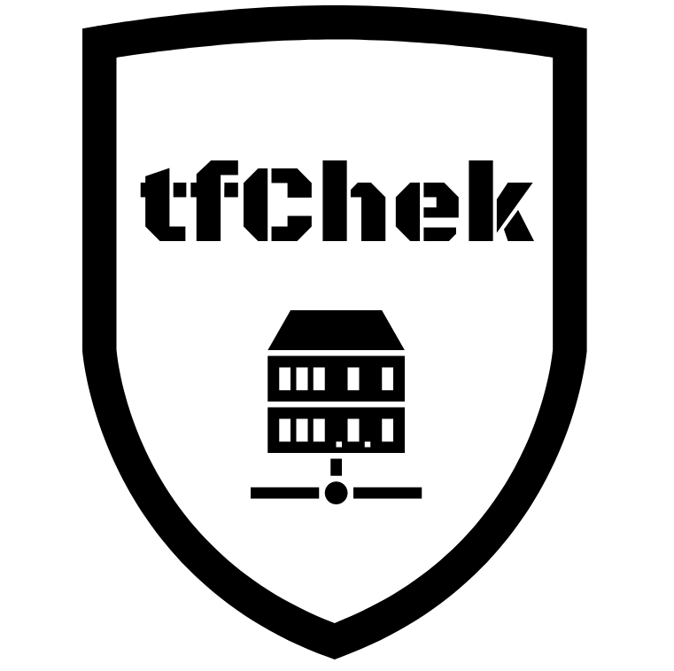
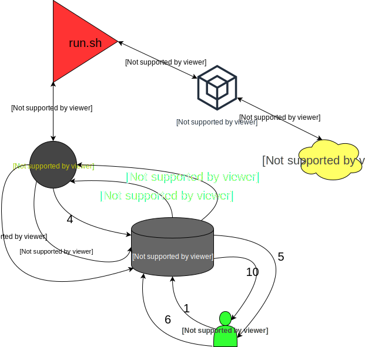
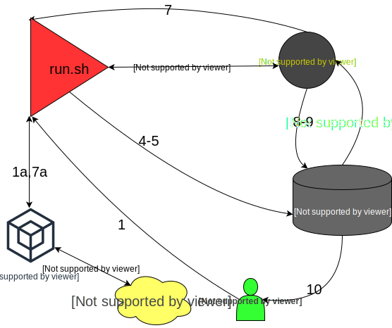
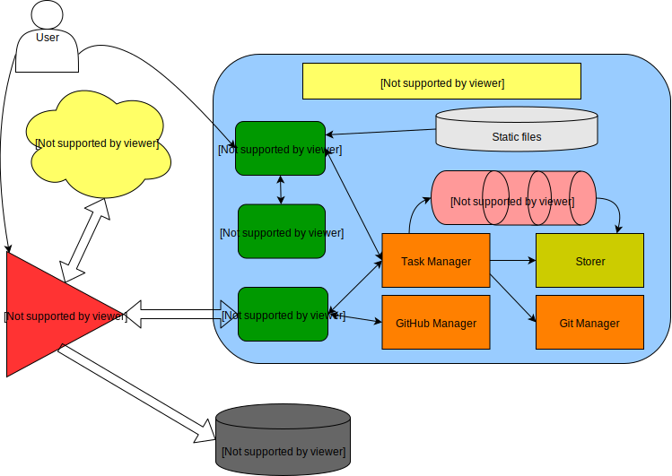

tfChek
======

This is a web application for Terrafrom continuous integration

_*tfChek*_ performs check of the applied terraform resources.
 * If check was successful it makes a pull request and tries to automatically merge it. 
 If it is impossible to merge the changes automatically, reviewer should make it manually. 
 GitHub will send an appropriate email notification.
 * In case of failed check the GitHub issue will be created and assigned to the author of the commit

> There is a project proposal document at Google Drive https://docs.google.com/document/d/1TlkHTV_RizPwoQPrgQ9G1FwDr9GJ05YlFODCxwi9oXQ/edit?usp=sharing

Flow
====
Push -> Apply
-------------

1. User launch run.sh command
    1. run.sh launches Terraform and other routines
    2. Terraform modifies cloud resources
2. In case of successful terraform run, run.sh notifies tfChek via API call and receives the task id
3. tfChek adds task to the queue until webhook arrives
4. run.sh lookups the modified erb templates and yml files and commits them to the branch tfci-<task id>
5. run.sh pushes the changes to the GitHub and exits
6. tfChek receives webhook with branch created notification
7. tfChek launches the same command as user have done, but without any targets. tfResDif should guess the changed resources
    1. run.sh launches Terraform and other routines    
    2. Terraform modifies cloud resources
8. In case of successful run (Everything is up to date), tfChek creates a GitHub Pull Request to merge branch tfci-<task id> to the master
    1. In case there are no merge conflicts, tfChek merges tfci-<task id> branch automatically
    2. In case of impossible merge by conflicts, user should resolve conflicts manually
9. In case of failed run, tfChek creates a GitHub issue, and assigns it to author
10. User receives notification from GitHub

Apply -> Push
-------------

1. User pushes the code in non-master branch
2. GitHub sends the webhook to the tfChek
3. tfChek runs run.sh in read only mode and gets Terraform plan
4. tfChek creates a GitHub pull request and comments it with Terraform plan output. 
5. GitHub notifies user about assigned pull request
6. User decides whether to approve or not approve this pull request
7. GitHub send a webhook to tfChek with notification of user action
8. If user approved plan tfChek runs run.sh to apply changes
9. tfChek performs GitHub API call
    1. In case of success tfChek will merge pull request automatically
    2. In case of failure the GitHub Issue will be created and assigned to author
10. User receives notification from GitHub

Components
==========

tfChek program contains several modules:
* API is responsible for receiving API calls and webhooks from GitHub
* WebSocket is responsible for online updating web UI with the task progress
* Static files is html and javascript files which are served by WebUI
* Web UI is a simple web page which displays task status. User can kill the task there
* Task manager responsible for managing task queues mapped by terraform state id
* Tasks is a buffered channels of run.sh command definitions
* Git manager is responsible for delivering proper code state from GitHub to the tfChek
* GitHub manager is responsible for GitHub API interaction
* Storer is responsible for saving tasks output to local filesystem or external resources
* run.sh is a helper script from former production_42 repository 

Changelog

*0.0.2*
>This version and all prior versions does not have any working version deployed
 It supports basic operations only. Nothing is well tested.

*0.0.3*
> Can copy task output

*0.0.4*
> Add buttons bar

*0.1.0*
> Application is able to create GitHub pull requests and GitHub issues. Send notifications via GitHub. Also it can automatically merge the pull requests.

*0.5.0*
> Add Github OAuth2 

*0.8.0*
> Add support of wtf
